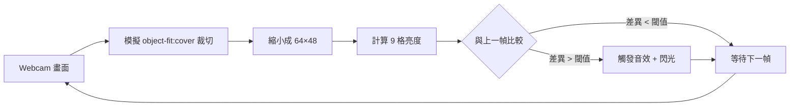
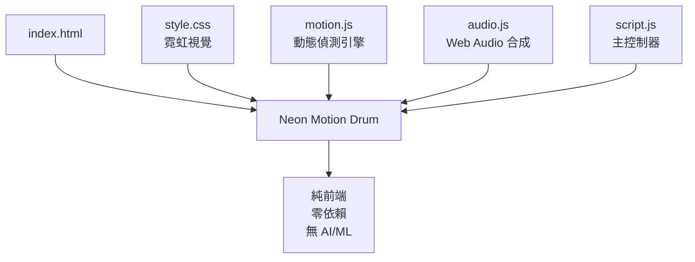

# Day 07 - Neon Motion Drum 霓虹動態鼓機

> [← 回到 Muripo HQ](https://tznthou.github.io/muripo-hq/)

用 Webcam 偵測手部動作，揮手觸發霓虹鼓聲！

## Demo

[Live Demo](https://tznthou.github.io/day-07-neon-drum/)

## 功能

- **動態偵測** - 純像素差異演算法，不需要 AI/ML 庫
- **9 種音效** - Web Audio API 合成電子鼓聲
- **視覺回饋** - 觸發時霓虹閃光動畫
- **零延遲** - 即時偵測，揮手馬上有聲音
- **多比例支援** - 自動適應 4:3 / 16:9 / 4K 攝影機

## 流程



## 快速開始

```bash
# 本地開發 (需要 localhost 才能使用攝影機)
npx serve .
```

## 使用方式

1. 開啟網頁，點擊「START」授權攝影機
2. 站在鏡頭前，揮手或擊打空氣
3. 手部經過的格子會觸發對應音效

## 鼓墊配置

```
┌─────┬─────┬─────┐
│ HH  │ SNR │ CYM │   HH = Hi-hat (腳踏鈸)
├─────┼─────┼─────┤   SNR = Snare (小鼓)
│ TM1 │ KCK │ TM2 │   CYM = Crash (碎音鈸)
├─────┼─────┼─────┤   TM = Tom (通鼓)
│ CLP │ RID │ SYN │   KCK = Kick (大鼓)
└─────┴─────┴─────┘   CLP = Clap (拍手)
                      RID = Ride (Ride鈸)
                      SYN = Synth (合成器)
```

## 控制選項

| 選項 | 說明 |
|------|------|
| 靈敏度 | 調整觸發門檻 (5-50)，數值越低越靈敏 |
| 冷卻 | 同一格子的觸發間隔 (100-500ms) |
| Debug | 顯示偵測視覺化，查看亮度變化 |

## 快捷鍵

| 快捷鍵 | 功能 |
|--------|------|
| `1-9` | 手動觸發對應格子 |

## 技術架構



### 核心模組

| 檔案 | 功能 |
|------|------|
| **motion.js** | 像素亮度差異偵測，64×48 低解析度運算，支援多種攝影機比例 |
| **audio.js** | Web Audio API 合成 9 種電子鼓聲（Kick, Snare, Hi-hat, Tom, Clap, Crash, Ride, Synth） |
| **script.js** | 主控制器，整合攝影機、偵測、音效、UI 互動 |
| **diag.js** | 診斷工具，用於檢測偵測問題 |

### 攝影機比例處理

偵測引擎會自動模擬 CSS `object-fit: cover` 的裁切行為，確保視覺顯示與偵測座標一致：

```
16:9 攝影機 (1920×1080)          偵測 Canvas (64×48 = 4:3)
┌────────────────────────┐       ┌──────────────┐
│ ▓▓ │   可見區域   │ ▓▓ │  →   │   裁切後的   │
│ ▓▓ │   (中央)    │ ▓▓ │       │   中央區域   │
└────────────────────────┘       └──────────────┘
      ↑ 左右裁切 ↑
```

## 診斷工具

如果遇到「部分格子沒有反應」的問題，可以使用診斷工具：

```javascript
// 在瀏覽器 Console 中執行
fetch('diag.js').then(r=>r.text()).then(eval)
```

診斷工具會：
1. 檢測攝影機解析度和比例
2. 分析各格子的亮度變化
3. 找出異常區域
4. 提供修復建議

## 瀏覽器支援

| 瀏覽器 | 支援 | 備註 |
|--------|------|------|
| Chrome / Edge | ✅ 推薦 | |
| Firefox | ✅ | |
| Safari | ✅ | iOS 14.3+ |
| 4K 攝影機 | ✅ | 自動適應 16:9 比例 |

## 隱私聲明

- 攝影機畫面僅在本地處理
- 不錄影、不上傳
- 所有運算在瀏覽器內完成

## License

[MIT](LICENSE)
