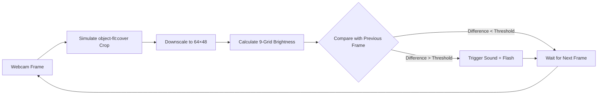
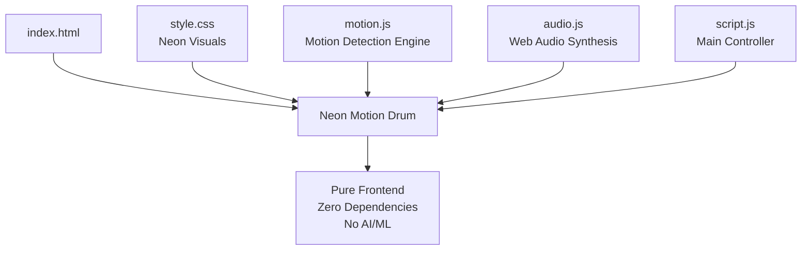

# Day 07 - Neon Motion Drum

> [← Back to Muripo HQ](https://tznthou.github.io/muripo-hq/) | [中文](README.md)

Detect hand movements with your webcam and trigger neon drum sounds by waving!

## Demo

[Live Demo](https://tznthou.github.io/day-07-neon-drum/)

## Features

- **Motion Detection** - Pure pixel difference algorithm, no AI/ML libraries required
- **9 Sound Effects** - Electronic drum sounds synthesized with Web Audio API
- **Visual Feedback** - Neon flash animation on trigger
- **Zero Latency** - Real-time detection, instant sound on wave
- **Multi-Aspect Ratio Support** - Auto-adapts to 4:3 / 16:9 / 4K cameras

## Flow



## Quick Start

```bash
# Local development (requires localhost for camera access)
npx serve .
```

## Usage

1. Open the webpage, click "START" to authorize camera
2. Stand in front of the camera, wave your hands or punch the air
3. The grid zone your hand passes through will trigger the corresponding sound

## Drum Pad Layout

```
┌─────┬─────┬─────┐
│ HH  │ SNR │ CYM │   HH = Hi-hat
├─────┼─────┼─────┤   SNR = Snare
│ TM1 │ KCK │ TM2 │   CYM = Crash Cymbal
├─────┼─────┼─────┤   TM = Tom
│ CLP │ RID │ SYN │   KCK = Kick
└─────┴─────┴─────┘   CLP = Clap
                      RID = Ride Cymbal
                      SYN = Synth
```

## Control Options

| Option | Description |
|--------|-------------|
| Sensitivity | Adjust trigger threshold (5-50), lower values = more sensitive |
| Cooldown | Trigger interval for each zone (100-500ms) |
| Debug | Show detection visualization to view brightness changes |

## Keyboard Shortcuts

| Shortcut | Action |
|----------|--------|
| `1-9` | Manually trigger corresponding grid zone |

## Technical Architecture



### Core Modules

| File | Function |
|------|----------|
| **motion.js** | Pixel brightness difference detection, 64×48 low-resolution processing, supports multiple camera aspect ratios |
| **audio.js** | Web Audio API synthesized 9 electronic drum sounds (Kick, Snare, Hi-hat, Tom, Clap, Crash, Ride, Synth) |
| **script.js** | Main controller, integrates camera, detection, audio, UI interaction |
| **diag.js** | Diagnostic tool for troubleshooting detection issues |

### Camera Aspect Ratio Handling

The detection engine automatically simulates CSS `object-fit: cover` cropping behavior to ensure visual display and detection coordinates remain consistent:

```
16:9 Camera (1920×1080)              Detection Canvas (64×48 = 4:3)
┌────────────────────────┐           ┌──────────────┐
│ ▓▓ │   Visible Area │ ▓▓ │  →     │   Cropped    │
│ ▓▓ │    (Center)    │ ▓▓ │        │ Center Area  │
└────────────────────────┘           └──────────────┘
      ↑ Left/Right Crop ↑
```

## Diagnostic Tool

If you encounter issues with "some zones not responding", use the diagnostic tool:

**Recommended**: Add `?diag` parameter to the URL
```
https://tznthou.github.io/day-07-neon-drum/?diag
```

**Alternative**: Manually load in browser Console
```javascript
fetch('diag.js').then(r=>r.text()).then(eval)
```

The diagnostic tool will:
1. Detect camera resolution and aspect ratio
2. Analyze brightness changes in each zone
3. Identify abnormal areas
4. Provide repair suggestions

## Browser Support

| Browser | Support | Notes |
|---------|---------|-------|
| Chrome / Edge | ✅ Recommended | |
| Firefox | ✅ | |
| Safari | ✅ | iOS 14.3+ |
| 4K Cameras | ✅ | Auto-adapts to 16:9 aspect ratio |

## Privacy Statement

- Camera footage is processed locally only
- No recording, no uploading
- All computations happen in the browser

## Extended Ideas

After watching myself testing in a recording, I suddenly realized this motion detection mechanism might be better suited for a **boxing training game**:

```
🥊 Imagine...

"Left hook!" → Wave towards the left zone
"Right hook!" → Wave towards the right zone
"Straight punch!" → Wave towards the center zone
"Uppercut!" → Wave towards the top zone
```

Combined with coach voice commands, combo counting, calorie estimation... it would definitely be fun!

Maybe one day I'll make this idea a reality 🎯

## License

[MIT](LICENSE)

---

## Author

Tzu-Chao - [tznthou@gmail.com](mailto:tznthou@gmail.com)
